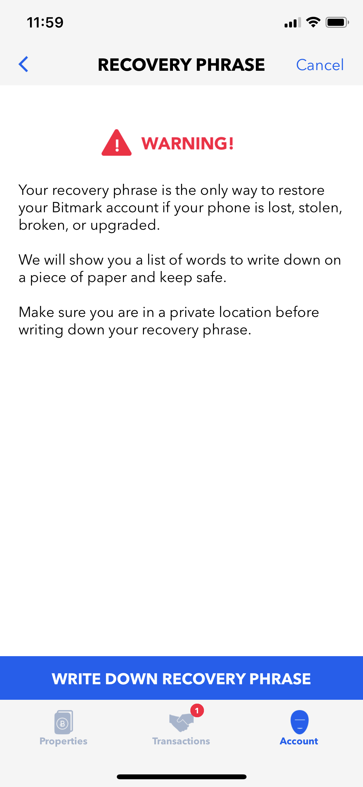

# Bitmark Account

Any user interacting with the Bitmark Property System requires a Bitmark Account. It can be created using the [Bitmark App](##Creating Bitmark Account using Bitmark App), the [Bitmark SDK](##Creating Bitmark Account using Bitmark SDK), or the [Bitmark CLI](##Creating Bitmark Account using Bitmark-CLI).

After creating the Account, a user will often want to recover the seed (which is the private key that can be used to control the Account) and the recovery phrase (which is a set of 12 mnemonic words that can be used to regenerate the seed).

<br>
<br>

## Bitmark Account Number

Property owners in Bitmark system are identified by their Ed25519 public keys. These public keys are represented by the Bitmark account numbers, which are in based58 format.

> * **Example:** Bitmark Account Number on [Livenet](https://registry.bitmark.com/account/bqSUHTVRYnrUPBEU48riv9UwDmdRnHm9Mf9LWYuYEa7JKtqgKw){:target="_blank"}
> 
>       `bqSUHTVRYnrUPBEU48riv9UwDmdRnHm9Mf9LWYuYEa7JKtqgKw`
>          
> * **Example:** Bitmark Account Number on [Testnet](https://registry.test.bitmark.com/account/fABCJxXc8aYGoj1yLLXmsGdWEo1Y5cZE9Ko5DrHhy4HvgGYMAu/owned){:target="_blank"}
> 
>       `fABCJxXc8aYGoj1yLLXmsGdWEo1Y5cZE9Ko5DrHhy4HvgGYMAu`

<br>
<br>

## Creating Bitmark Account using the Bitmark App

Bitmark App is a simple mobile app which allows anyone to protect their legal rights to their data and other digital assets by registering them as properties on the Bitmark blockchain.

<br>
Here are the steps to create a new Bitmark Account using the Bitmark App:

* Download and install the [Android](https://apps.apple.com/us/app/bitmark-property-registry/id1429427796){:target="_blank"} or [iOS](https://apps.apple.com/us/app/bitmark-property-registry/id1429427796){:target="_blank"} Bitmark App

* Open the app

* Start creating a new Bitmark Account by tapping the **Create New Account** option
    
    > There are options to enable Touch/Face ID and Notification while creating a new account 

    <div style="background-color: #efefef; text-align: center;">
        
         
        
    </div>

    <br>

* Check for the Account Number by accessing **Account > SETTINGS**

    > The Bitmark App allows users to
    >
    > * **Copy** the Account Number to clipboard directly by tapping on it 
    >
    > * **Display** the Account Number as a QR Code by tapping on the QR Code icon.

    <div style="background-color: #efefef; text-align: center;">
        
        
    </div>

    <br>

* Backup the Recovery Phrase by selecting **Account > SETTINGS > WRITE DOWN RECOVERY PHRASE**

    <div style="background-color: #efefef; text-align: center;">
        
        
        
    </div>

<br>
<br>

## Creating Bitmark Account using the Bitmark SDK

The Bitmark SDK is a collection of libraries for different programming languages and mobile platforms. In addition to providing language-specific bindings to the Bitmark APIs, the SDK simplifies local key management for signing and encryption.

>In this section we introduce a very simple way to create a new Bitmark Account using **Bitmark JS SDK**.<br>
>For the detailed explanation, further, functions and other languages - Please look at the [Bitmark SDK](https://github.com/bitmark-inc/docs/blob/master/bitmark-references/bitmark-sdk/bitmark-sdk-document.md){:target="_blank"} section.

<br>

Here are the steps to install the Bitmark-SDK, initalize its configuration, then create a new Bitmark Account and export the related information:

* Install Bitmark JS SDK

    `# npm install bitmark-sdk`

* Initialize the SDK configuration

    ```js
        const sdk = require('bitmark-sdk');

        const config = {
            API_token: "api-token",
            network: "testnet"
        };

        sdk.init(config);
    ```

    > The SDK supports two options for the network, each requires the corresponding API tokens
    > 
    > * "livenet" - all the requests are submitted to the public Bitmark blockchain which is the main chain. 
    > 
    > * "testnet" - all the requests are submitted to the testing Bitmark blockchain which is normally used for testing and developing activities.

<br>

* Create a new Bitmark account:

    ```js
    let account = new sdk.Account();
    ```

* Get the Account number:

    ```js
    let account_number = account.getAccountNumber();
    ```

* Get the Account seed:
    ```js
    let seed = account.getSeed();
    ```
* Get the Account recovery phrase:
    ```js
    let phrase = account.getRecoveryPhrase();
    ```

<br>
<br>
## Creating Bitmark Account using the Bitmark-CLI

Bitmark-CLI is a command line tool which allows a user to interact with the Bitmark blockchain by connecting to one or several nodes in the network. All the transactions are submitted directly to one of the connected nodes and consequently be verified by the node before be forwarded to the network.

> In this section, we introduce very simple commands to create a new Bitmark Account using the Bitmark-CLI
> For the command structures, detailed explanation, other functions - Please refer the [Bitmark-CLI](https://github.com/bitmark-inc/docs/blob/master/bitmark-references/bitmark-cli/bitmark-cli.md){:target="_blank"} section.

<br>
> The basic structure of a Bitmark-CLI command:  
>   `bitmark-cli [global-options] command [command-options]`

<br>
    
> The Bitmark-CLI determines which network the command will be sent to by the global option `--network` (abbreviation: `-n`) with the following possible values
> 
>* `bitmark`:  the live network which uses live BTC or LTC to pay for the transactions.
>
>* `testing`:  a network for testing newly developed programs, it uses testnet coins to pay for transactions.
> 
>* `local`: a special case for running a regression test network on the loopback interface.

<br>

Following are the intructions to create Bitmark account with the network option as `testing`

* Install [Bitmark-CLI](https://github.com/bitmark-inc/docs/blob/master/bitmark-references/bitmark-cli/bitmark-cli.md){:target="_blank"}

* Initalize the Bitmark-CLI configuration

    ```shell
    $ bitmark-cli -n <network> -i <identity> \
    setup -c <node>:2130 -d '<description>' -n
    ```

    >The `setup` command is used to initialize the Bitmark-CLI config file. The command options:
    >
    >* `network` - The network to which the command is sent.
    > 
    >* `identity` - The identity of the Bitmark-CLI user.
    >
    >* `node` - The Bitmark node, to which the Bitmark-CLI connects, all the transactions performed on the Bitmark-CLI are submitted to this node.
    >
    >* `description` - The idententity’s description. The command above creates a user with the identity as first and the description as first user.
    >
    >* `-n` (abbr. of --new) - Indicate the action of creating a new account.
    
    *Example:*
 
    ```shell
    $ bitmark-cli -n testing -i first \
    setup -c 128.199.89.154:2130 -d 'first user' -n
    ```

<br>

*  Add an additional Bitmark account
    ```shell
    $ bitmark-cli -n <network> -i <identity> \
    add -d '<description>' -n
    ```

    > The `add` command is to add a new user after the Bitmark-CLI configuration was initialized. 
    > The command options have the same meanings as in the `setup` command.
    
    *Example:*  
    ```shell
    $ bitmark-cli -n testing -i second \
    add -d 'second user' -n
    ```

<br>

* Check the account numbers
    ```shell
    $ bitmark-cli -n <network> list
    ```

    > The `list` command is to list all the users of the Bitmark-CLI.
    
    *Example:*

    ```shell
    $ bitmark-cli -n testing list
    ```
    ```
    SK first    fUuNhZ6CC4YxUkQB99nuLnUiEevEuwdCoYszJ9Y5uUjp8oiA3A  "first user"
    SK second   fPWWkW45o12er6oP4EveaURHXstkSXR3odWCgpaDvEvxoR3woC  "second user"
    ```


<br>

* Get the account seed and recovery phrase for an identity
    ```shell
    $ bitmark-cli -n <network> -i <identity> seed
    ```

    > The `seed` command is to print out all the information of a Bitmark-CLI user. Because sensitive data is included, the user password is required.
    
    *Example:*
 
    ```shell
    $ bitmark-cli -n testing -i first seed
    ```
    ```json
    {
        "privateKey": "BQVdbCAVQ1KHv4sDSQ5d874BfZYmLeeJveNGXThxU4WKh5K39o6eEVqoBZFKbJWHiJgkyYThnBFdfF9bgSGmhyDLsk7oR9",
        "seed": "9J87ApGrXzDitFk8eviHf31RNXbTcjW8S",
        "description": "first user",
        "name": "first",
        "account": "fUuNhZ6CC4YxUkQB99nuLnUiEevEuwdCoYszJ9Y5uUjp8oiA3A",
        "recovery_phrase": "lamp between sponsor butter lawn ski venture autumn anger corn bullet catalog"
    }
    ```

<br>

>**NOTE:** 
>
>* The account creation commands require users to provide and confirm password
>
>* All the identity-required commands ask for the account password. 

