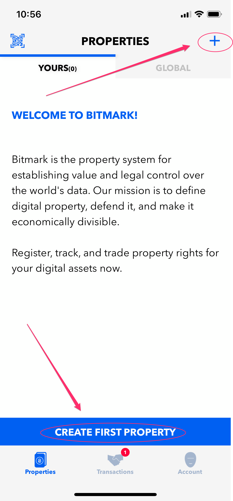
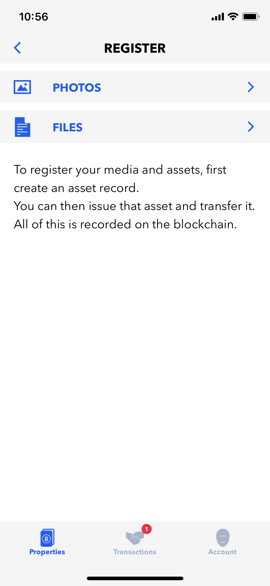
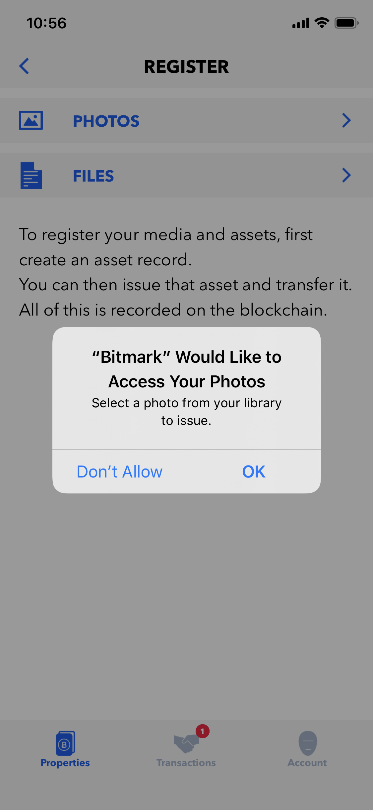
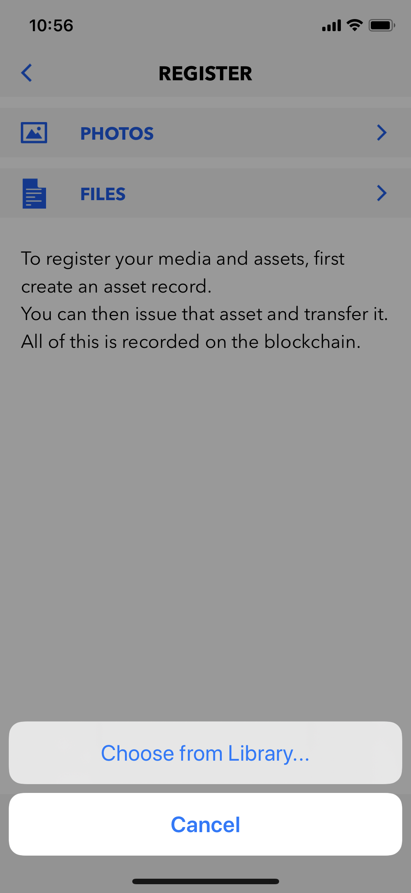
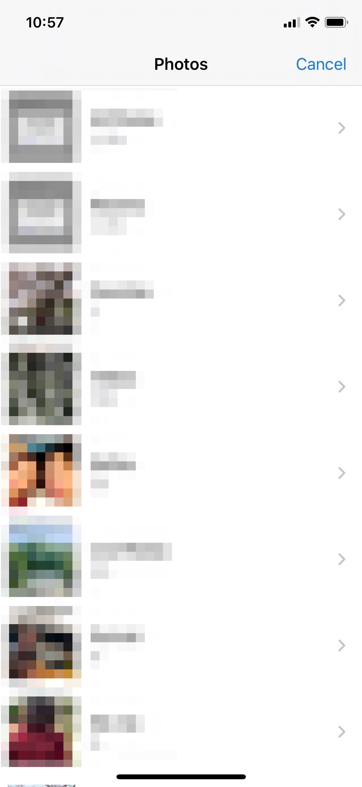
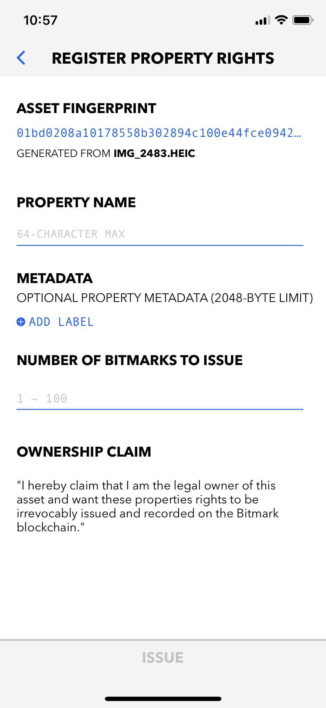
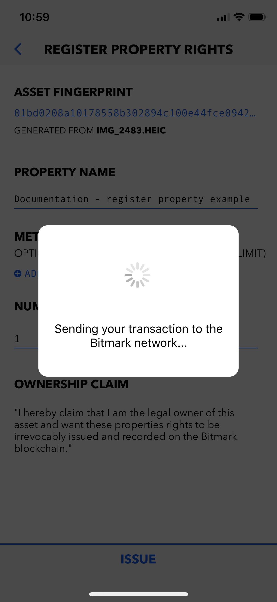
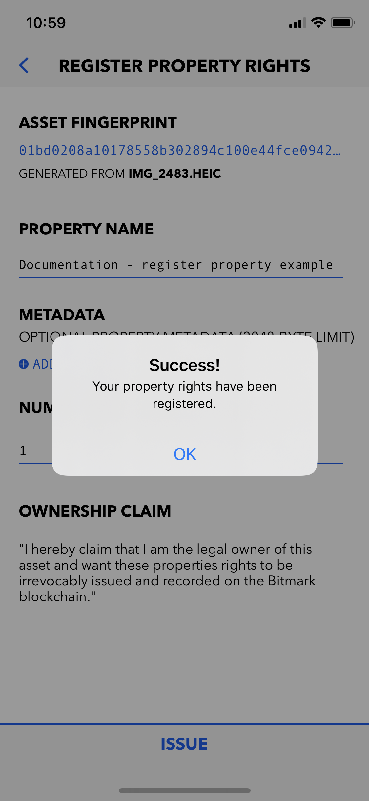

# Registering Bitmark Certificates

Assets with titles that have been publicly recorded are more valuable than those without. They are what grant basic rights, such as the ability to resell, rent, lend, and donate. The Bitmark Blockchain offers the opportunity to register titles for your digital assets. To do so, you could use the [Bitmark App](##Registering properties using Bitmark App), the [Bitmark SDK](##Registering properties using Bitmark SDK), or the [Bitmark CLI](##Registering properties using Bitmark-CLI).


<br>

>The process of registering Bitmark Certificates for your digital assets basically contains two steps
>
>* Registering your asset - results in a *Asset Record* stored on the Bitmark blockchain.
>
>* Issuing bitmarks -  results in *Issue Records* linking to the corresponding asset record and stored on the Bitmark blockchain.
> 
> 

<br>

> **NOTE:** Any user interacting with the Bitmark Property System requires a Bitmark Account.
> Please refer to the [Bitmark Account](creating-bitmark-account.md){:target="_blank"} section for instructions on creating a new Bitmark Account.

<br>
<br>

## Registering Bitmark Certificates using the Bitmark App

The Bitmark app registers legal property rights on the public Bitmark blockchain for your digital assets, including personal health and social data, creative works such as art, photography, and music, and other intellectual property. These legal rights determine who owns property and what can be done with it, whether you want to keep it, sell it, or donate it.

<br>
Here are the steps to register a new property using the Bitmark app:

* On the PROPERTIES screen - Tap **CREATE FIRST PROPERTY** or **+** 

    > It opens the **PROPERTIES > REGISTER** screen

    <div style="background-color: #efefef; text-align: center;">
        
        
    </div>

    <br>

* Tap **PHOTOS** or **FILES** to browse the desired asset

    > The permission to access `Photos` and/or `Files` must be granted.

    <div style="background-color: #efefef; text-align: center;">
        
        
        
    </div>

    <br>

* Fill in the required information

    > As soon as the desired asset is selected, the app computes the asset's fingerprint and opens the **REGISTER PROPERTY RIGHTS** screen, which allows users to provide more detailed information about the asset.

    >* Currently, the `PROPERTY NAME` and `NUMBER OF BITMARKS TO ISSUE` fields are mandatory.

    >* For each `Asset`, a user can issue multiple `Bitmark Certificates` - defined by  `number of bitmarks` in the **REGISTER PROPERTY RIGHTS** screen.

    <div style="background-color: #efefef; text-align: center;">
        
        
    </div>

    <br>

* Tap **ISSUE** button

    >As soon as users tap **ISSUE**, the app submits both the `Asset Registration` request and `bitmarks Issuance` transactions to the Bitmark network. It would takes few seconds for the submission to be successful. After that the properties will be added to the **PROPERTIES > YOURS** screen.
    > 
    > **NOTE:** It will take several minutes for the transactions to be confirmed on the Bitmark blockchain after submitted. 

    <div style="background-color: #efefef; text-align: center;">
        
        
        
    </div>

<br>

* [Verify](https://github.com/bitmark-inc/docs/) bitmark transactions.


<br>
<br>
## Registering Bitmark Certificates using the Bitmark SDK

<br>
>In this section we introduce a very simple way to register properties using **Bitmark JS SDK**.<br>
>For the detailed explanation, further, functions and other languages - Please look at the [Bitmark SDK](https://github.com/bitmark-inc/docs/blob/master/bitmark-references/bitmark-sdk/bitmark-sdk-document.md){:target="_blank"} section.

<br>
Following are the instructions for registering a property to the testing Bitmark blockchain using the Bitmark JS SDK

* Register an asset:

    ```js
    let name = "Example asset";
    let metadata = {"Example key":"Example alue"};

    let params = sdk.Asset.newRegistrationParams(name, metadata);
    await params.setFingerprint(filepath);
    params.sign(account);

    let assets = (await sdk.Asset.register(params)).assets;

    let assetId = assets[0].id;
    ```

* Issue the first bitmark 

    ```js
    let issueParams = sdk.Bitmark.newIssuanceParams(assetId, 1);
    issueParams.sign(account);

    let bitmarks = (await sdk.Bitmark.issue(issueParams)).bitmarks;

    let bitmarkId = bitmarks[0].id;
    ```

* [Verify](https://github.com/bitmark-inc/docs/){:target="_blank"} bitmark transactions.

<br>
<br>
## Registering Bitmark Certificates using the Bitmark-CLI 

> In this section, we introduce very simple commands to create a new Bitmark Account using the Bitmark-CLI
> For the command structures, detailed explanation, other functions - Please refer the [Bitmark-CLI](https://github.com/bitmark-inc/docs/blob/master/bitmark-references/bitmark-cli/bitmark-cli.md){:target="_blank"} section.

<br>
    
> The Bitmark-CLI determines which network the command will be sent to by the global option `--network` with the following possible values
> 
>* `bitmark`:  the live network which uses live BTC or LTC to pay for the transactions.
>
>* `testing`:  a network for testing newly developed programs, it uses testnet coins to pay for transactions.
> 
>* `local`: a special case for running a regression test network on the loopback interface.

<br>

Following are the steps to registering a new property with the network option as `testing`

* Compute the hash of an asset

    ```shell
    $ bitmark-cli -n <network> \
    fingerprint -f <file>
    ```

    > The `fingerprint` command is to compute the hash of a file
    >
    > * `file` - Define the file from which the hash is computed.

    *Example:*

    ```shell
    $ bitmark-cli -n testing \
    fingerprint -f test.txt
    ```
    ```json
    {
        "file_name": "filename.test",
        "fingerprint": "0122aa7d05ce9d324feca37780eeeeb7af8611eefb61cfe42bf9f8127071b481520b529e06c9f0799c7527859361f1694acef106d5131a96641eae524e1c323500"
    }
    ```

<br>

* Issue the first bitmark

    ```shell
    $ bitmark-cli -n <network> -i <identity> \
    create -a '<asset name>' \
    -m '<asset metadata>' \
    -f <asset fingerprint> \
    -z
    ```

    > The `create` command is to register an asset from a fingerprint along with issuing the corresponding bitmarks
    >
    >* `asset name` - Define the `name` field in the asset record.
    >
    >* `asset metadata` - Define the `metadata` field in the asset record.
    > 
    >* `-f` option - Determine the hash of the asset.
    >
    >* `-z` option - Determine that it is the issuance of the first bitmark of the asset.

    *Example:* 
    
    ```shell
    $ bitmark-cli -n testing -i first \
    create -a 'Example asset' \
    -m 'Key1\u0000Value1\u0000Key2\u0000Value2' \
    -f 0122aa7d05ce9d324feca37780eeeeb7af8611eefb61cfe42bf9f8127071b481520b529e06c9f0799c7527859361f1694acef106d5131a96641eae524e1c323500 \
    -z
    ```
    ```json
    {
        "assetId": "dac17bef505f7a5acf890a1d0f232b7d847f1e951cf1f5b880de13253a10df43cdbcab553e08050808e0b3fdfd2581a798dcdf9cedbbddf4476ead14caa612d3",
        "issueIds": [
            "b069f2956b828281dec040782eea3d63793ab4cf17c26f7639e95f6f3b20ba23"
        ],
        "payId": "b30bf53de9f6ae5ca59259fd695566bce692d422201c222ff136ab3193f16301e055b1030ce46a1981f439105b3a96e2",
        "payNonce": "a7b23fc462594028",
        "difficulty": "0000ffffffffffffff8000000000000000000000000000000000000000000000",
        "submittedNonce": "00000001a67fa973",
        "proofStatus": "Accepted"
    }
    ```

<br>

* [Verify](https://github.com/bitmark-inc/docs/){:target="_blank"} bitmark transactions.


