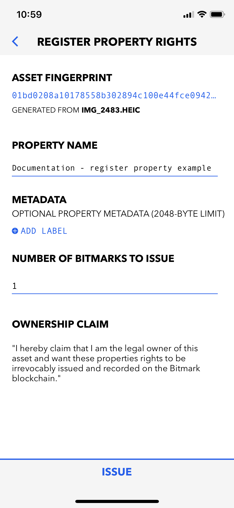
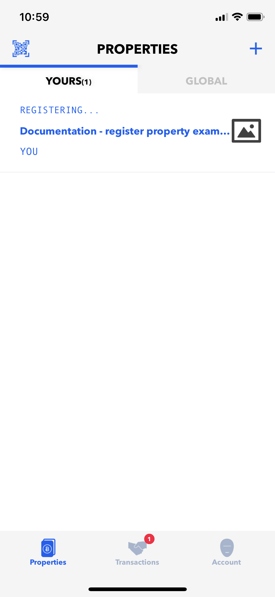

# Registering Bitmark Certificates

Assets with titles that have been publicly recorded are more valuable than those without. They are what grant basic rights, such as the ability to resell, rent, lend, and donate. The Bitmark Blockchain offers the opportunity to register titles for your digital assets. To do so, you could use the [Bitmark App](#registering-bitmark-certificates-using-the-bitmark-app), the [Bitmark SDK](#registering-bitmark-certificates-using-the-bitmark-sdk), or the [Bitmark CLI](#registering-bitmark-certificates-using-the-bitmark-cli).


<br>

>The process of registering Bitmark Certificates for your digital assets basically contains two steps
>
>* Registering your asset - results in a *Asset Record* stored on the Bitmark blockchain.
>
>* Issuing bitmarks -  results in *Issue Records* linking to the corresponding asset record and stored on the Bitmark blockchain.

<br>
<br>

## Prerequisites

A Bitmark Account is required for any user who want to interact with the Bitmark Property System. Please refer to the [Bitmark Account](creating-bitmark-account.md) section for instructions on creating a new Bitmark Account.

<br>
<br>

## Registering Bitmark Certificates using the Bitmark App

The Bitmark app registers legal property rights on the public Bitmark blockchain for your digital assets, including personal health and social data, creative works such as art, photography, and music, and other intellectual property. These legal rights determine who owns property and what can be done with it, whether you want to keep it, sell it, or donate it.

<br>

Here are the steps to register a new property using the Bitmark app:

* On the PROPERTIES screen - Tap **CREATE FIRST PROPERTY** or **+** 

    > It opens the **PROPERTIES > REGISTER** screen

    <div style="background-color: #efefef; text-align: center;">
        
        
    </div>

    <br>

* Tap **PHOTOS** or **FILES** to browse the desired asset

    > The permission to access `Photos` and/or `Files` must be granted.

    <div style="background-color: #efefef; text-align: center;">
        
        
        
    </div>

    <br>

* Fill in the required information

    > As soon as the desired asset is selected, the app computes the asset's fingerprint and opens the **REGISTER PROPERTY RIGHTS** screen, which allows users to provide more detailed information about the asset.
    >
    >* Currently, the `PROPERTY NAME` and `NUMBER OF BITMARKS TO ISSUE` fields are mandatory.
    >
    >* For each `Asset`, a user can issue multiple `Bitmark Certificates` - defined by  `number of bitmarks` in the **REGISTER PROPERTY RIGHTS** screen.

    <div style="background-color: #efefef; text-align: center;">
        
        
    </div>

    <br>

* Tap **ISSUE** button

    >As soon as users tap **ISSUE**, the app submits both the `Asset Registration` request and `bitmarks Issuance` transactions to the Bitmark network. It would takes few seconds for the submission to be successful. After that the properties will be added to the **PROPERTIES > YOURS** screen.
    > 
    > **NOTE:** It will take several minutes for the transactions to be confirmed on the Bitmark blockchain after submitted. 

    <div style="background-color: #efefef; text-align: center;">
        
        
        
    </div>

<br>


<br>
<br>

## Registering Bitmark Certificates using the Bitmark SDK

As a KIT for developers to interact with the Bitmark Property System, the Bitmark-SDKs provide interfaces for users to submit transactions to the Bitmark blockchain including the asset registration and bitmark issuance.

<br>

Here are the steps to register Bitmark Certificates of an asset using the **Bitmark JS SDK**:

* Register an asset:

    ```js
    // Create a Bitmark Account as the Issuer
    let account = new sdk.Account();

    // Define the asset name & metadata
    let name = "Example asset";
    let metadata = {"Example key":"Example alue"};

    // Build and sign the asset registration request
    let params = sdk.Asset.newRegistrationParams(name, metadata);
    await params.setFingerprint(filepath);
    params.sign(account);

    // Send the request
    let assets = (await sdk.Asset.register(params)).assets;

    let assetId = assets[0].id;
    ```

    <br>

* Issue the first bitmark 

    ```js
    // Build and sign the bitmark issuance request
    let issueParams = sdk.Bitmark.newIssuanceParams(assetId, 1);
    issueParams.sign(account);

    // Send the request
    let bitmarks = (await sdk.Bitmark.issue(issueParams)).bitmarks;

    let bitmarkId = bitmarks[0].id;
    ```

    <br>

* Verify the issuance transaction by querying for the bitmark by its bitmark Id

    ```js
        await Bitmark.get(bitmarkId);
    ```

   

<br>
<br>

## Registering Bitmark Certificates using the Bitmark CLI 

The Bitmark CLI allows users to register Bitmark Certificates by submitting the transactions to its connected node, and then broadcasting to the network. 

<br>

> The basic structure of a Bitmark CLI command:  
>   `bitmark-cli [global-options] command [command-options]`

<br>
    
> The Bitmark-CLI determines which network the command will be sent to by the global option `--network` with the following possible values
> 
>* `bitmark`:  the live network which uses live BTC or LTC to pay for the transactions.
>
>* `testing`:  a network for testing newly developed programs, it uses testnet coins to pay for transactions.
> 
>* `local`: a special case for running a regression test network on the loopback interface.

<br>

Here are the steps to register a new Bitmark Certificate using the Bitmark CLI

* Compute the hash of an asset

    ```shell
    $ bitmark-cli -n <network> \
    fingerprint -f <file>
    ```

    > The `fingerprint` command is to compute the hash of a file
    >
    > * `file` - Define the file from which the hash is computed.

    *Example:*

    ```shell
    $ bitmark-cli -n testing \
    fingerprint -f test.txt
    ```
    ```json
    {
        "file_name": "filename.test",
        "fingerprint": "0122aa7d05ce9d324feca37780eeeeb7af8611eefb61cfe42bf9f8127071b481520b529e06c9f0799c7527859361f1694acef106d5131a96641eae524e1c323500"
    }
    ```

<br>

* Issue the first bitmark

    ```shell
    $ bitmark-cli -n <network> -i <identity> \
    create -a '<asset name>' \
    -m '<asset metadata>' \
    -f <asset fingerprint> \
    -z
    ```

    > The `create` command is to register an asset from a fingerprint along with issuing the corresponding bitmarks
    >
    >* `asset name` - Define the `name` field in the asset record.
    >
    >* `asset metadata` - Define the `metadata` field in the asset record.
    > 
    >* `-f` option - Determine the hash of the asset.
    >
    >* `-z` option - Determine that it is the issuance of the first bitmark of the asset.

    *Example:* 
    
    ```shell
    $ bitmark-cli -n testing -i first \
    create -a 'Example asset' \
    -m 'Key1\u0000Value1\u0000Key2\u0000Value2' \
    -f 0122aa7d05ce9d324feca37780eeeeb7af8611eefb61cfe42bf9f8127071b481520b529e06c9f0799c7527859361f1694acef106d5131a96641eae524e1c323500 \
    -z
    ```
    ```json
    {
        "assetId": "dac17bef505f7a5acf890a1d0f232b7d847f1e951cf1f5b880de13253a10df43cdbcab553e08050808e0b3fdfd2581a798dcdf9cedbbddf4476ead14caa612d3",
        "issueIds": [
            "b069f2956b828281dec040782eea3d63793ab4cf17c26f7639e95f6f3b20ba23"
        ],
        "payId": "b30bf53de9f6ae5ca59259fd695566bce692d422201c222ff136ab3193f16301e055b1030ce46a1981f439105b3a96e2",
        "payNonce": "a7b23fc462594028",
        "difficulty": "0000ffffffffffffff8000000000000000000000000000000000000000000000",
        "submittedNonce": "00000001a67fa973",
        "proofStatus": "Accepted"
    }
    ```

<br>

* Verify the status of the bitmark issuance transaction

    ```shell
    $ bitmark-cli -n <network>\
      status -t <txid>
    ```

    > The `create` command is to register an asset from a fingerprint along with issuing the corresponding bitmarks
    >
    >* `asset name` - Define the `name` field in the asset record.
    >
    >* `asset metadata` - Define the `metadata` field in the asset record.
    > 
    >* `-f` option - Determine the hash of the asset.
    >
    >* `-z` option - Determine that it is the issuance of the first bitmark of the asset.

    *Example:* 
    
    ```shell  
    $ bitmark-cli -n testing \
      status -t \
      b069f2956b828281dec040782eea3d63793ab4cf17c26f7639e95f6f3b20ba23
    ```

    ```json
    // Check right after the create command 
    {
      "status": "Pending"
    }

    // Check again after several minutes
    {
      "status": "Confirmed"
    }
    ```

<br>
<br>

## Explore the Bitmark transactions using the Bitmark Registry website

Bitmark build a web application for users to explore all the transactions happened on the Bitmark blockchain at:
    
* For transactions on the Bitmark livenet blockchain: https://registry.bitmark.com

* For transaction on the Bitmark testnet blockchain: https://registry.bitmark.com


