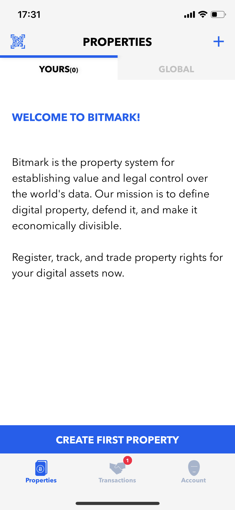

# Transferring bitmarks

Once an asset has been registered, trading it only requires the owner to create a new transfer record that points back to the original issue record (or to the previous transfer record) and that shows the new owner of the asset. Because the blockchain is ordered and because it’s immutable, this creates a permanent chain of custody, reaching back to the asset’s origins.

<div style="background-color: #efefef; text-align: center;">
    
</div>

The bitmark transfer are able to be performed using

* The [Bitmark App](#transferring-bitmarks-using-bitmark-app)

* The [Bitmark SDK](#transferring-bitmarks-using-bitmark-sdk)

* The [Bitmark CLI](#transferring-bitmarks-using-bitmark-cli)

<br>
<br>

## Prerequisites

* [Bitmark Accounts](creating-bitmark-account.md) are created.

* [Bitmark Certificates](issuing-bitmarks.md) are registered.

* In case of using the Bitmark CLI, [Payment on Bitmark CLI](payment-on-bitmark-cli.md) tools need to be ready.

<br>
<br>

## Transferring bitmarks using Bitmark App

The Bitmark App allows a user to transfer a bitmark to another account by accessing the Property details screen and selecting the Transfer option.

* From the **Properties > YOURS** screen, tap on the desired property to open the Property details screen

    <div style="background-color: #efefef; text-align: center;">
        
        
    </div>

    <br>

* Tap on the `...` on the top right corner to open the options and select the **TRANSFER** option

    <div style="background-color: #efefef; text-align: center;">
        
        
    </div>

    <br>

* Fill in the recipient account and tap **TRANSFER**

    <div style="background-color: #efefef; text-align: center;">
        
        
    </div>

    <br>

* Observe changes on the sender side - The property disappears

    <div style="background-color: #efefef; text-align: center;">
        
    </div>

    <br>

* Observe changes on the recipient side right after the transfer

    <div style="background-color: #efefef; text-align: center;">
        
        
    </div>

    <br>

* Observe changes on the recipient side after some minutes

    <div style="background-color: #efefef; text-align: center;">
        
        
    </div>

<br>
<br>

## Transferring bitmarks using Bitmark SDK

As a KIT for developers to interact with the Bitmark Property System, the Bitmark-SDKs provide interfaces for users to submit transactions to the Bitmark blockchain including the bitmark transfer.

<br>

Here are the steps to transfer bitmarks using the **Bitmark JS SDK**:

* Submit a transfer transaction

    ```js
        let transferParams = Bitmark.newTransferParams(recipientAccount);
        await transferParams.fromBitmark(bitmarkid);
        transferParams.sign(sender);

        let txs = (await Bitmark.transfer(transferParams)).txs;
        let txId = txs[0].id;
    ```

<br>

* Verify the transfer transaction

    ```js
        await Transaction.get(txId);
    ```

<br>
<br>

## Transferring bitmarks using Bitmark CLI

The Bitmark CLI allows users to transfer bitmarks by submitting the transactions to its connected node, and then broadcasting to the network.

<br>

> The basic structure of a Bitmark CLI command:
>   `bitmark-cli [global-options] command [command-options]`

<br>

> The Bitmark CLI determines which network to send the command by using the global option `--network` (abbreviation: `-n`). Option values:
>
>* `bitmark`:  the live network which uses live BTC or LTC to pay for the transactions.
>
>* `testing`:  a network for testing newly developed programs, it uses testnet coins to pay for transactions.
>
>* `local`: a special case for running a regression test network on the loopback interface.

<br>

Here are the steps to transfer a Bitmark Certificate using the Bitmark CLI

* Submit a transfer request

    ```shell
    $ bitmark-cli -n <network> -i <sender identity>\
      transfer -r <receiver> \
      -t <txid> -u
    ```
    
    > The `transfer` command is to submit a transfer transaction to the network. The options:
    >
    >* `sender identity` - The identity of the sender's Bitmark Account which is created and stored in the Bitmark CLI config file
    >
    >* `receiver` - The identitifer of the recipient's Bitmark Account. It can be the Bitmark Account Number or the Bitmark Account's identity which is created and stored in the Bitmark CLI config file
    >
    > `txid` - The id of the last transaction of the bitmark which is transferring.
    >
    >**NOTE:** A transfer transaction on the Bitmark blockchain requires a transaction fee of 0.0002 BTC (20000 satoshis) or 0.002 LTC (200000 photons). Therefore, after the `transfer` command, the user needs to execute the payment for the transaction to be confirmed on the blockchain. The payment information is included in the output of the `transfer` command.

    *Example:*

    ```shell
    $ bitmark-cli -n testing -i first\
      transfer -r second \
      -t 6b35dfb5d623f6cae22fd03b3e28f1fde5255a29c1328a5d39ddfdfcd0ce6cf9 -u
    ```
    ```json
    {
      "transferId": "4656604222152d08606d42a40c8590c2100c177cafe374ea90bae30c5bd371e0",
      "bitmarkId": "7e3337ae7596864e6dfd918c07780480ef80cea96fa039ed17d35c3849fcb3ca",
      "payId": "d819cff364b9211093fe09c2b462bdd05154472a72fac91a882a8f1129674dc92ac5d2724c8d26b16d414de8fbc5c62e",
      "payments": {
        "BTC": [
          {
            "currency": "BTC",
            "address": "mr8DEygRvQwKfP4sVZuHVozqvzW89e193j",
            "amount": "20000"
          }
        ],
        "LTC": [
          {
            "currency": "LTC",
            "address": "mzkCaHJmu1gdnsL9jxW2bwqtw2MCCy66Ds",
            "amount": "200000"
          }
        ]
      }
    },
    "commands": {
      "BTC": "bitmark-wallet --conf ${XDG_CONFIG_HOME}/bitmark-wallet/test/test-bitmark-wallet.conf btc --testnet sendmany --hex-data 'd819cff364b9211093fe09c2b462bdd05154472a72fac91a882a8f1129674dc92ac5d2724c8d26b16d414de8fbc5c62e' 'mnTuuYNZmmswFT8iqr7ex82HAQYLJ8LXkC,10000' 'mr8DEygRvQwKfP4sVZuHVozqvzW89e193j,20000'",
      "LTC": "bitmark-wallet --conf ${XDG_CONFIG_HOME}/bitmark-wallet/test/test-bitmark-wallet.conf ltc --testnet sendmany --hex-data 'd819cff364b9211093fe09c2b462bdd05154472a72fac91a882a8f1129674dc92ac5d2724c8d26b16d414de8fbc5c62e' 'mzkCaHJmu1gdnsL9jxW2bwqtw2MCCy66Ds,200000'"
    }
    ```

  >**Note:** The transfer command auto generates the Bitmark Wallet command to pay for the transaction and displays them at the end of the output.

<br>

* Paying for the bitmark transfer using the Bitmark-Wallet

    ```shell
    #Run the bitcoind
    $ bitcoind -datadir=<bitcoind config dir>

    # OR run the litecoind
    $ litecoind -datadir=<litcoind config dir>

    #Pay by BTC
    $ bitmark-wallet --conf <Bitmark-Wallet config file> btc --<btc network> \
      sendmany --hex-data '<payId>' '<btc address>,<btc amount in satoshi>'

    #OR Pay by LTC
    $ bitmark-wallet --conf <Bitmark-Wallet config file> ltc --<ltc network> \
      sendmany --hex-data '<payId>' '<ltc address>,<ltc amount in photon>'

    ```

    >To execute a bitcoin or litecoin transaction on the local environment, the bitcoind or litecoind need to be running.
    >
    > - `payId` - The payment id for the share creation transaction, it is printed in the output of share creation command

    <br>

    > **NOTE:** The payment is able to be performed using another tool which allows users to add the exact hex data to an OP_RETURN as part of the coin transaction

    *Example of paying by ltc:*

    ```shell
    # run litecoind
    $ bitcoind -datadir=~/.config/litecoin/

    # Perform payment
    $ bitmark-wallet --conf ~/.config/bitmark-wallet/test/test-bitmark-wallet.conf \
      ltc --testnet \
      sendmany --hex-data \
      'd819cff364b9211093fe09c2b462bdd05154472a72fac91a882a8f1129674dc92ac5d2724c8d26b16d414de8fbc5c62e' \
      'mzkCaHJmu1gdnsL9jxW2bwqtw2MCCy66Ds,200000'
    ```
    ```json
    {
      "txId": "ca94ae188ba8bfdc42e026950c5e13a2f1082dae484a45c5dc29217ac0c9a23f",
      "rawTx": "0100000001b76a37054a086c5bd68afd61914bb4badc78c9e7ef59e6b692777cc18063632d020000006b483045022100db6f27ec3e1e59c34887f262217d5ff819947c561f0ecd11034ba8b32dbdc87002203ef82d80be8e43434eb16e22248e4533a1d3c2831e19802ce55a308604d76f3c012103b45a55c3e48209581d63ba5ceea9a0e94ae49e18056d85a6dadec535dbe237a2ffffffff03400d0300000000001976a914d2ebb7b259fb7410dca19b707c4091195d818ac488ac8091e305000000001976a9142d477753d17099534f9249b54cda36081d4e5eba88ac0000000000000000326a30d819cff364b9211093fe09c2b462bdd05154472a72fac91a882a8f1129674dc92ac5d2724c8d26b16d414de8fbc5c62e00000000"
    }
    ```

<br>

* Verifying the status of the share creation transaction

    ```shell
    $ bitmark-cli -n <network> \
      status -t <transferId>
    ```

    >The `status` command is to query a transaction's status. The options:
    >
    >* `transferId` - The transfer transaction id which is printed as `transferId` in the output of the `transfer` command.
    >
    >The returned status:
    >
    >* `Pending` - Has not been paid.
    >
    >* `Verified` - Paid but not confirmed on the blockchain.
    >
    >* `Confirmed` - Confirmed on the blockchain.


    *Example:*

    ```shell
    $ bitmark-cli -n testing \
      status -t \
      4656604222152d08606d42a40c8590c2100c177cafe374ea90bae30c5bd371e0
    ```
    ```json
    //Right after the payment
    {
      "status": "Verified"
    }

    //Check again fter some minutes
    {
      "status": "Confirmed"
    }
    ```

    <br>

* Verifying the bitmark's provenance

    ```shell
    $ bitmark-cli -n <network> \
      provenance -t <transferID>
    ```

    >The `provenance` command returns all the transaction records from the transaction corresponding to the inputted txid back to the bitmark's asset registration record. The options:
    >
    >* `transferID` - `transferId` - The transfer transaction id which is printed as `transferId` in the output of the `transfer` command.
    >


    *Example:*

    ```shell
    $ bitmark-cli -n testing \
      provenance -t \
      4656604222152d08606d42a40c8590c2100c177cafe374ea90bae30c5bd371e0
    ```
    ```json
    {
      "data": [
        {
          "record": "BitmarkTransferUnratified",
          "isOwner": true,
          "txId": "4656604222152d08606d42a40c8590c2100c177cafe374ea90bae30c5bd371e0",
          "inBlock": 31101,
          "data": {
            "escrow": null,
            "link": "7e3337ae7596864e6dfd918c07780480ef80cea96fa039ed17d35c3849fcb3ca",
            "owner": "fPWWkW45o12er6oP4EveaURHXstkSXR3odWCgpaDvEvxoR3woC",
            "signature": "1d378c7e...7dafcc02"
          },
          "_IDENTITY": "second"
        },
        {
          "record": "BitmarkIssue",
          "isOwner": false,
          "txId": "7e3337ae7596864e6dfd918c07780480ef80cea96fa039ed17d35c3849fcb3ca",
          "inBlock": 31100,
          "data": {
            "assetId": "813b2eb5...de9219a7",
            "nonce": 0,
            "owner": "fUuNhZ6CC4YxUkQB99nuLnUiEevEuwdCoYszJ9Y5uUjp8oiA3A",
            "signature": "4581ee97...9b24f20f"
          },
          "_IDENTITY": "first"
        },
        {
          "record": "AssetData",
          "isOwner": false,
          "inBlock": 31100,
          "assetId": "813b2eb5...de9219a7",
          "data": {
            "fingerprint": "01cdb27c...50514f0c",
            "metadata": "Key1\u0000Value1\u0000Key2\u0000Value2",
            "name": "Example asset 3",
            "registrant": "fUuNhZ6CC4YxUkQB99nuLnUiEevEuwdCoYszJ9Y5uUjp8oiA3A",
            "signature": "d6cc18e5...47efe909"
          },
          "_IDENTITY": "first"
    }
    ```


<br>
<br>

## Explore the Bitmark transactions using the Bitmark Registry website

Bitmark build a web application for users to explore all the transactions happened on the Bitmark blockchain at:

* For transactions on the Bitmark livenet blockchain: https://registry.bitmark.com

* For transaction on the Bitmark testnet blockchain: https://registry.bitmark.com


