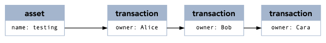
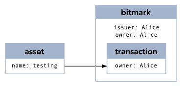
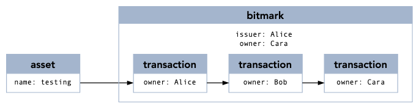
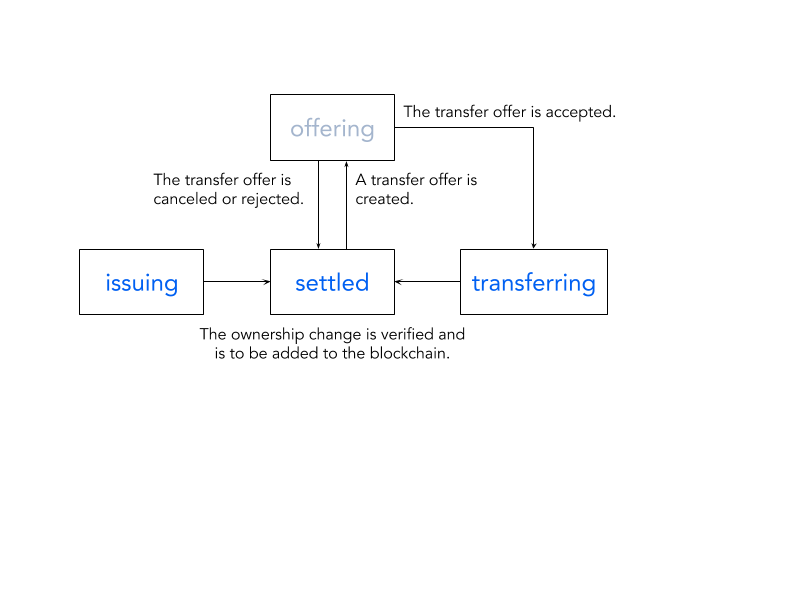

# Queries

The Bitmark SDK support queries about assets, bitmarks, and transactions (txs), which are records that are created or updated when different actions (register, issue, or transfer) occur.

For the retrieval of a single record, use the record ID (`asset_id` for an asset, `bitmark_id` for a bitmark, or `tx_id` for a transaction) with the standard function to retrieve that specific record.

For the retrieval of a collection of records, use one of several query functions to select a set of records based on specific criteria. 

All records support the following filters:

- `pending`: determines whether to include pending records that are not yet added to the blockchain
- `limit`: sets the maximum number of records to be returned in one query
- `offset`: returns the records that are updated subsequently

<!-- TODO: explain how to iterate all records -->

Both bitmark and transaction record can be linked to a fundamental asset record, so they support two extra query parameters:

- `referenced_asset`: specifies the asset ID that the records link to
- `load_asset`: determines whether to include referenced asset objects

The actual query functions could be in snake case or camel case depends on which SDK is used. For simplicity, the camel case is used for explanation.

## Asset

An asset record is available when it's registered and there is at least one accompanying bitmark issuance.

### Record data structure

| Attribute | Description |
| --------- | ----------- |
| id | The asset ID |
| name | The asset name |
| metadata | The asset metadata, described by key-value pairs |
| fingerprint | The hash value of the asset content, which serves as the unique identifier for the asset record in the blockchain |
| registrant | The account registering the asset |
| status | The status on the blockchain, which has possible values of `pending` or `confirmed` |
| block_number | The block that incorporates the asset record |
| offset | An auto-incremental number, which increments when the data is updated |
| created_at | The time when the asset status becomes `confirmed` |

### Querying for a specific asset



````javascript
let response = await Asset.get(assetId);
````


````swift
let response = Asset.get(assetID: assetId)
````


```go
import (
	"github.com/bitmark-inc/bitmark-sdk-go/asset"
)

// This sample assumes the SDK is already correctly initialized
func getAssetExample() {
    asset, err := asset.Get(assetId)
}
```


```java
Asset.get(assetId, new Callback1<AssetRecord>() {
            @Override
            public void onSuccess(AssetRecord asset) {

            }

            @Override
            public void onError(Throwable throwable) {

            }
        });
```



### Querying for a set of assets

#### Assets registered by the specific registrant

To retrieve a set of all assets registered by a specific account, use the account number of the registrant as the query argument.



````javascript
let assetQueryParams = Asset.newAssetQueryBuilder()
    .registeredBy("ec6yMcJATX6gjNwvqp8rbc4jNEasoUgbfBBGGyV5NvoJ54NXva")
    .pending(true)
    .limit(10)
    .build();

let response = await Asset.list(assetQueryParams);
````


````swift
let params = try Asset.newQueryParams()
                .limit(size: 100)
                .registeredBy(registrant: "ec6yMcJATX6gjNwvqp8rbc4jNEasoUgbfBBGGyV5NvoJ54NXva")

let assets = try Asset.list(params: params)
````


```go
// import bmAsset "github.com/bitmark-inc/bitmark-sdk-go/asset"
params := bmAsset.NewQueryParamsBuilder().
		RegisteredBy("ec6yMcJATX6gjNwvqp8rbc4jNEasoUgbfBBGGyV5NvoJ54NXva").
		Limit(10)
assets, err := bmAsset.List(params)
```


```java
AssetQueryBuilder builder = new AssetQueryBuilder().limit(limit).registeredBy(registrant);
Asset.list(builder, new Callback1<List<AssetRecord>>() {
            @Override
            public void onSuccess(List<AssetRecord> assets) {

            }

            @Override
            public void onError(Throwable throwable) {

            }
        });
```



## Transaction (tx)

A new transaction record is generated when one of the following actions occurs:

- a new bitmark is issued
- a bitmark is transferred
- an offer is accepted

Actions that are applied to the same bitmark will create a chain of transactions linked by `previous_id` (See [Record data structure](###-Record-data-structure)).



### Record data structure

| Attribute | Description |
| --------- | ----------- |
| id | The tx ID |
| owner | The account owning the bitmark |
| previous_id | A link to the previous tx (ignored for issue tx) |
| previous_owner | The previous owner of the bitmark (ignored for issue tx) |
| bitmark_id | A link to the bitmark that this tx is applied to |
| asset_id | The asset ID |
| status | The status on the blockchain, which has possible values of `pending` or `confirmed` |
| block_number | The block that incorporates the tx record |
| offset | An auto-incremental number that increments when the data is updated |
| confirmation | the number of blocks in the blockchain that have been accepted by the network since the block that includes the transaction |
| countersign | Whether this tx is a two-signature transfer |

### Querying for a specific transaction



````javascript
let txResponse = await Transaction.get(txId);
````


```swift
let tx = try Transaction.get(transactionID: "3bfe21170de3ff1767a166896cf9c69c12534b77c75509b673d02489405a5bf1")
```


```go
// import bmTx "github.com/bitmark-inc/bitmark-sdk-go/tx"
tx, err := bmTx.Get("3bfe21170de3ff1767a166896cf9c69c12534b77c75509b673d02489405a5bf1")
```


```java
Transaction.get(txId, new Callback1<GetTransactionResponse>() {
            @Override
            public void onSuccess(GetTransactionResponse res) {

            }

            @Override
            public void onError(Throwable throwable) {

            }
        });
```



### Querying for a set of transactions

#### Transactions depicting the provenance of a bitmark

To retrieve the set of transactions that make up provenance of a bitmark, use a bitmark as an argument. This will produce a list of transaction records that show the ownership changes of a bitmark. If a bitmark is issued by user A, and then transferred to user B then to user C, the return will include three transactions with user A, B, and C as transaction owners respectively.



````javascript
let transactionQueryParams = Transaction.newTransactionQueryBuilder()
    .referencedBitmark("c8e021c1a093c32909e4d29b4624f8a5443e349a597314b7c9527ce310749121")
    .build();

let response = await Transaction.list(transactionQueryParams);
````


````swift
let query = try Transaction.newTransactionQueryParams()
    .referenced(toBitmarkID: "58737de5ad68a535da6277da62d11eb3ed76ff6dd7fc2adf3c42a4096d9a2518")
let (txs, _) = try Transaction.list(params: query)
````


```go
// import bmTx "github.com/bitmark-inc/bitmark-sdk-go/tx"
params := bmTx.NewQueryParamsBuilder().
    ReferencedBitmark("58737de5ad68a535da6277da62d11eb3ed76ff6dd7fc2adf3c42a4096d9a2518")
txs, referencedAssets, err := bmTx.List(params)
```


```java
TransactionQueryBuilder builder = new TransactionQueryBuilder()
                                .referencedBitmark("58737de5ad68a535da6277da62d11eb3ed76ff6dd7fc2adf3c42a4096d9a2518");
Transaction.list(builder, new Callback1<GetTransactionsResponse>() {
            @Override
            public void onSuccess(GetTransactionsResponse res) {

            }

            @Override
            public void onError(Throwable throwable) {

            }
        });
```



#### Transactions created by an account

To retrieve the set of transactions initiated by the same account, use the account ID as an argument.
<!-- TODO: what does this mean? -->



````javascript
let transactionQueryParams = Transaction.newTransactionQueryBuilder()
    .ownedBy("eZpG6Wi9SQvpDatEP7QGrx6nvzwd6s6R8DgMKgDbDY1R5bjzb9")
    .build();

let response = await Transaction.list(transactionQueryParams);
````


````swift
let query = try Transaction.newTransactionQueryParams()
    .owned(by: "eZpG6Wi9SQvpDatEP7QGrx6nvzwd6s6R8DgMKgDbDY1R5bjzb9", transient: true)
let (txs, _) = try Transaction.list(params: query)
````


```go
// import bmTx "github.com/bitmark-inc/bitmark-sdk-go/tx"
params := bmTx.NewQueryParamsBuilder().
    OwnedBy("eZpG6Wi9SQvpDatEP7QGrx6nvzwd6s6R8DgMKgDbDY1R5bjzb9")
txs, referencedAssets, err := bmTx.List(params)
```


```java
TransactionQueryBuilder builder = new TransactionQueryBuilder()
                                .ownedBy("eZpG6Wi9SQvpDatEP7QGrx6nvzwd6s6R8DgMKgDbDY1R5bjzb9");
Transaction.list(builder, new Callback1<GetTransactionsResponse>() {
            @Override
            public void onSuccess(GetTransactionsResponse res) {

            }

            @Override
            public void onError(Throwable throwable) {

            }
        });
```



## Bitmark

The bitmark record is a compact data structure that depicts a chain of transaction records for the same digital property.

When a bitmark is issued, the corresponding bitmark and transaction record are created.



When a bitmark is transferred, more transaction records are added to the property chain and the bitmark record is updated.



### Record data structure

| Attribute | Description |
| --------- | ----------- |
| id | The bitmark ID |
| asset_id | The asset ID |
| latest_tx_id | The latest tx ID |
| issuer | The account issuing the bitmark |
| owner | The account currently owning the bitmark |
| offer | A set of attributes, described under [offer](#offer-data-structure) below. |
| status | The current status of a bitmark, which can be `issuing`, `transferring`, `offering`, or `settled`. See the following diagram for definitions. |
| block_number | The block that incorporates the latest tx of this bitmark |
| offset | An auto-incremental number that increments when the data is updated |
| created_at | The time when the bitmark was issued |
| confirmed_at | The last time when the bitmark was transferred |



#### Offer data structure

| Attribute | Description |
| --------- | ----------- |
| id | The offer ID |
| from | The account creating the offer |
| to | The account which can accept/reject the offer |
| record | The half-signed transfer tx |
| extra_info | An attached JSON message for indicating the details of this offer |
| created_at | The create time of the offer |

### Querying for a specific bitmark



````javascript
let response = await Bitmark.get(bitmarkId, false); // false: not include asset, true: include asset
````


````swift
let bitmark = Bitmark.get(bitmarkID: bitmarkId);
````


```go
// import bmBitmark "github.com/bitmark-inc/bitmark-sdk-go/bitmark"
bitmark, err := bmBitmark.Get("3bfe21170de3ff1767a166896cf9c69c12534b77c75509b673d02489405a5bf1")
```


```java
Bitmark.get(bitmarkId, new Callback1<GetBitmarkResponse>() {
            @Override
            public void onSuccess(GetBitmarkResponse res) {
                BitmarkRecord bitmark = res.getBitmark();
            }

            @Override
            public void onError(Throwable throwable) {

            }
        });
```



### Querying for a set of bitmarks

#### Bitmarks issued by a specific issuer

To list the bitmarks that are issued by the specific account number, use that account as an argument. The issuer can increase the quality of each returned bitmark.

<!-- TODO: Better explain what "increase the quality" means -->
<!-- TODO: examples -->

#### Bitmarks owned by a specific owner

To list the bitmarks that are currently owned by the specific account number, use that account as an argument. The owner can transfer any of the returned bitmarks to any other receiver.

<!-- TODO: examples -->

#### Bitmarks offered from the specific sender

To list the bitmarks that are offered by a sender, use that account as an argument. The sender can take action on these bitmarks (synchronise as cancel an offer).

<!-- TODO: examples -->

#### bitmarks offered to the specific receiver

To list the bitmarks which are offered to a receiver, use that account as an argument. The receiver can take actions on these bitmarks (such as accept or reject an offer).

<!-- TODO: examples -->
